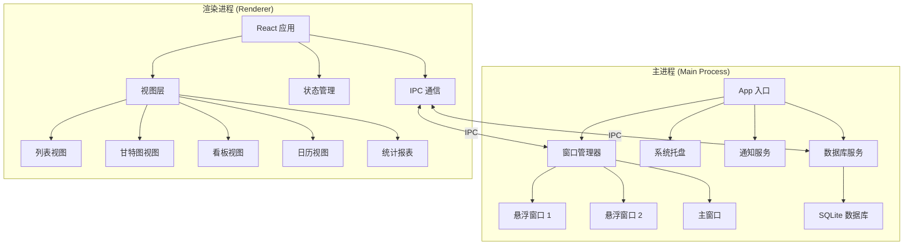
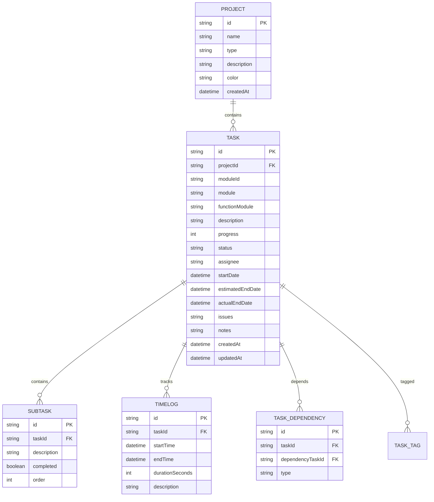

## 产品概述

一款基于 Electron + React 的桌面端 Todo List 任务管理软件，支持悬浮窗口显示，提供项目化任务管理和计划排期功能。

## 核心功能

### 任务信息管理

每个任务包含完整字段：

- 模块、功能模块、任务描述
- 进度（百分比）、任务状态
- 责任人、开始时间、预计完成时间、实际完成时间
- 存在的问题、备注

### 项目管理

- 个人项目和公司项目分类
- 支持多项目并行管理

### 悬浮窗口特性

- 可拖拽移动位置
- 可调节透明度
- 点击穿透功能（鼠标穿过窗口操作后方应用）
- 最小化到系统托盘
- 支持多个悬浮窗口同时显示

### 多视图展示

- 列表视图：基础任务列表展示
- 甘特图视图：时间排期和任务依赖关系可视化
- 看板视图：拖拽式任务状态管理
- 日历视图：按日期维度查看任务分布
- 统计报表：进度分析和时间追踪数据可视化

### 高级功能

- 任务提醒/桌面通知
- 任务依赖关系（前置/后置任务）
- 子任务分解（多级任务树）
- 时间追踪（记录实际工时）
- 导出功能（Excel/PDF/Markdown）
- 标签/分类系统
- 搜索和过滤
- 深色/浅色主题切换

## 技术栈选择

### 核心框架

- **桌面框架**: Electron 28+（跨平台支持，成熟的桌面 API）
- **前端框架**: React 18 + TypeScript（类型安全，组件化开发）
- **构建工具**: Vite（快速开发和构建）
- **样式方案**: Tailwind CSS + CSS Modules（原子化 CSS + 局部样式）

### 数据存储

- **本地数据库**: SQLite3（better-sqlite3 或 sql.js）
- **ORM**: Prisma 或 Drizzle ORM（类型安全的数据库操作）
- **云端同步预留**: 设计同步接口，支持后续集成腾讯云开发或自建后端

### 关键依赖

- **窗口管理**: electron-window-state（窗口位置持久化）
- **系统托盘**: electron-tray（系统托盘图标和菜单）
- **通知系统**: electron-notifications（桌面通知）
- **甘特图**: dhtmlx-gantt 或 react-gantt-timeline
- **导出功能**: 
- Excel: exceljs 或 xlsx
- PDF: pdfkit 或 puppeteer
- Markdown: marked
- **日期处理**: dayjs（轻量级日期库）
- **状态管理**: Zustand 或 Redux Toolkit（全局状态管理）
- **UI 组件**: shadcn/ui 或 Ant Design（桌面端组件库）

## 技术架构

### 系统架构

采用 Electron 主进程 - 渲染进程分离架构，结合 MVC 分层模式：



### 模块划分

#### 1. 主进程模块

- **WindowManager**: 窗口创建、管理、悬浮窗口特殊配置
- **TrayManager**: 系统托盘图标和菜单管理
- **NotificationService**: 桌面通知发送
- **DatabaseService**: SQLite 数据库连接和 CRUD 操作
- **IPC Handlers**: 处理渲染进程 IPC 请求

#### 2. 渲染进程模块

- **Views**: 5 种视图组件（列表/甘特图/看板/日历/统计）
- **Components**: 可复用 UI 组件（任务卡片、表单、过滤器等）
- **Stores**: Zustand 状态管理（任务、项目、视图状态）
- **Hooks**: 自定义 React Hooks（useTasks, useProjects, useFilters）
- **Services**: API 调用封装（IPC 通信抽象）
- **Utils**: 工具函数（日期格式化、数据导出等）

#### 3. 数据类型定义

```typescript
interface Task {
  id: string;
  projectId: string;
  moduleId: string;
  module: string;          // 模块
  functionModule: string;  // 功能模块
  description: string;     // 任务描述
  progress: number;        // 进度 0-100
  status: TaskStatus;      // 任务状态
  assignee: string;        // 责任人
  startDate: Date;         // 开始时间
  estimatedEndDate: Date;  // 预计完成时间
  actualEndDate?: Date;    // 实际完成时间
  issues: string;          // 存在的问题
  notes: string;           // 备注
  dependencies: string[];  // 依赖任务 IDs
  subtasks: Subtask[];     // 子任务
  timeLogs: TimeLog[];     // 时间追踪记录
  tags: string[];          // 标签
  createdAt: Date;
  updatedAt: Date;
}

interface Project {
  id: string;
  name: string;
  type: 'personal' | 'company';  // 个人/公司项目
  description: string;
  color: string;
  createdAt: Date;
}
```

### 数据库设计



## 实现细节

### 悬浮窗口实现

```typescript
// 主进程窗口配置
const createFloatingWindow = (options: FloatingWindowOptions) => {
  const win = new BrowserWindow({
    width: 400,
    height: 600,
    frame: false,                    // 无边框
    transparent: true,               // 透明背景
    alwaysOnTop: true,               // 始终置顶
    skipTaskbar: true,               // 不显示在任务栏
    resizable: false,
    movable: true,                   // 可拖拽
    hasShadow: false,
    webPreferences: {
      nodeIntegration: false,
      contextIsolation: true,
      preload: path.join(__dirname, 'preload.js')
    }
  });
  
  // 点击穿透
  win.setIgnoreMouseEvents(options.clickThrough ?? false, { forward: true });
  
  // 透明度
  win.setOpacity(options.opacity ?? 1.0);
  
  return win;
};
```

### IPC 通信设计

```typescript
// 预加载脚本 (preload.ts)
contextBridge.exposeInMainWorld('electronAPI', {
  // 窗口控制
  setWindowOpacity: (opacity: number) => ipcRenderer.invoke('window:setOpacity', opacity),
  toggleClickThrough: () => ipcRenderer.invoke('window:toggleClickThrough'),
  minimizeToTray: () => ipcRenderer.invoke('window:minimizeToTray'),
  
  // 任务 CRUD
  getTasks: (filters?: TaskFilters) => ipcRenderer.invoke('tasks:getAll', filters),
  createTask: (task: TaskInput) => ipcRenderer.invoke('tasks:create', task),
  updateTask: (id: string, updates: Partial<Task>) => ipcRenderer.invoke('tasks:update', id, updates),
  deleteTask: (id: string) => ipcRenderer.invoke('tasks:delete', id),
  
  // 项目管理
  getProjects: () => ipcRenderer.invoke('projects:getAll'),
  createProject: (project: ProjectInput) => ipcRenderer.invoke('projects:create', project),
  
  // 通知
  sendNotification: (title: string, body: string) => ipcRenderer.invoke('notification:send', title, body),
  
  // 导出
  exportToExcel: (data: any[]) => ipcRenderer.invoke('export:excel', data),
  exportToPDF: (data: any[]) => ipcRenderer.invoke('export:pdf', data),
  exportToMarkdown: (data: any[]) => ipcRenderer.invoke('export:markdown', data),
});
```

### 性能优化策略

1. **虚拟滚动**: 列表视图使用 react-window 实现虚拟滚动，支持千级任务流畅渲染
2. **数据分页**: 甘特图和日历视图采用按需加载，只渲染可见时间范围数据
3. **防抖节流**: 搜索、过滤操作使用防抖（300ms），窗口拖拽使用节流
4. **数据库索引**: 为 projectId、status、assignee、startDate 等常用查询字段建立索引
5. **增量更新**: 任务状态变更时只更新变更字段，避免全量重渲染
6. **Worker 线程**: 导出功能和复杂统计计算使用 Worker 线程，避免阻塞 UI

### 安全性考虑

1. **IPC 验证**: 所有 IPC 调用进行参数验证和权限检查
2. **SQL 注入防护**: 使用参数化查询，禁止字符串拼接 SQL
3. **XSS 防护**: React 默认转义 + CSP 策略配置
4. **文件访问控制**: 限制数据库文件访问路径，防止路径遍历攻击
5. **敏感数据加密**: 可选加密存储敏感任务信息（使用 electron-store 加密）

## 目录结构

```
e:/AZE-BlackCore/
└── TodoListDesktop/
    ├── package.json
    ├── tsconfig.json
    ├── vite.config.ts
    ├── electron-builder.json
    ├── .eslintrc.json
    ├── .prettierrc.json
    ├── main/                        # 主进程代码
    │   ├── index.ts                 # 主进程入口
    │   ├── window-manager.ts        # 窗口管理
    │   ├── tray-manager.ts          # 托盘管理
    │   ├── ipc-handlers/            # IPC 处理器
    │   │   ├── task-handlers.ts
    │   │   ├── project-handlers.ts
    │   │   ├── window-handlers.ts
    │   │   └── export-handlers.ts
    │   ├── services/
    │   │   ├── database.ts          # 数据库服务
    │   │   ├── notification.ts      # 通知服务
    │   │   └── export-service.ts    # 导出服务
    │   └── utils/
    │       └── logger.ts
    ├── preload/
    │   └── index.ts                 # 预加载脚本
    ├── renderer/                    # 渲染进程 (React 应用)
    │   ├── index.html
    │   ├── src/
    │   │   ├── main.tsx
    │   │   ├── App.tsx
    │   │   ├── components/          # 可复用组件
    │   │   │   ├── ui/              # 基础 UI 组件
    │   │   │   ├── task/            # 任务相关组件
    │   │   │   ├── project/         # 项目相关组件
    │   │   │   └── common/          # 通用组件
    │   │   ├── views/               # 视图组件
    │   │   │   ├── ListView.tsx
    │   │   │   ├── GanttView.tsx
    │   │   │   ├── KanbanView.tsx
    │   │   │   ├── CalendarView.tsx
    │   │   │   └── DashboardView.tsx
    │   │   ├── stores/              # 状态管理
    │   │   │   ├── task-store.ts
    │   │   │   ├── project-store.ts
    │   │   │   └── view-store.ts
    │   │   ├── hooks/               # 自定义 Hooks
    │   │   │   ├── useTasks.ts
    │   │   │   ├── useProjects.ts
    │   │   │   └── useFloatingWindow.ts
    │   │   ├── services/            # API 服务
    │   │   │   └── api.ts
    │   │   ├── types/               # 类型定义
    │   │   │   ├── task.ts
    │   │   │   ├── project.ts
    │   │   │   └── index.ts
    │   │   ├── utils/               # 工具函数
    │   │   │   ├── date.ts
    │   │   │   ├── export.ts
    │   │   │   └── formatters.ts
    │   │   ├── styles/              # 样式文件
    │   │   │   ├── globals.css
    │   │   │   └── themes/
    │   │   └── assets/              # 静态资源
    │   └── public/
    │       └── icon.ico
    ├── database/
    │   └── schema.sql               # 数据库初始脚本
    └── docs/
        └── README.md
```

## 设计风格

采用现代简约商务风格，结合玻璃拟态（Glassmorphism）设计元素，打造专业且美观的桌面应用界面。

### 设计原则

1. **清晰层次**: 通过阴影、透明度、间距建立清晰的视觉层次
2. **高效交互**: 减少点击次数，常用操作一键可达
3. **视觉反馈**: 悬停、点击、拖拽均有流畅动画反馈
4. **主题自适应**: 深色/浅色主题无缝切换，保持视觉一致性

### 悬浮窗口设计

- 半透明磨砂玻璃效果背景
- 细边框 + 轻微阴影增强边界感
- 顶部拖拽区域 + 快捷操作按钮（透明度、穿透、关闭）
- 紧凑布局，最大化信息密度
- 支持多窗口平铺显示，颜色区分不同项目

### 主界面设计

- 左侧导航栏：项目列表 + 视图切换
- 顶部工具栏：搜索、过滤、视图选项、主题切换
- 中央内容区：根据视图类型动态渲染
- 右侧面板：任务详情/快速编辑（可折叠）

### 五种视图设计要点

**列表视图**:

- 可折叠的分组列表（按模块/状态/责任人分组）
- 斑马纹 + 悬停高亮
- 进度条可视化
- 快捷操作菜单

**甘特图视图**:

- 时间轴缩放（日/周/月）
- 任务依赖连线可视化
- 关键路径高亮
- 里程碑标记

**看板视图**:

- 可自定义状态列
- 拖拽卡片更新状态
- 卡片颜色区分优先级
- 列统计（任务数/完成度）

**日历视图**:

- 月/周/日切换
- 任务点标记
- 点击日期快速创建任务
- 截止日期高亮

**统计报表**:

- 进度仪表盘
- 燃尽图/燃起图
- 时间分布饼图
- 效率趋势折线图

## Agent Extensions

### Skill

- **ui-ux-pro-max**
- Purpose: 提供 UI/UX 设计指导和实现建议，确保界面设计的专业性和美观性
- Expected outcome: 获得符合现代设计标准的组件规范、交互流程和视觉样式建议

- **artifacts-builder**
- Purpose: 创建复杂的多组件前端界面原型，用于预览和验证设计方案
- Expected outcome: 生成可交互的 UI 原型，帮助验证设计决策和用户体验

- **javascript-typescript**
- Purpose: 提供 Electron + React + TypeScript 开发最佳实践和代码实现指导
- Expected outcome: 确保代码质量符合 TypeScript 严格模式，遵循 Electron 安全规范